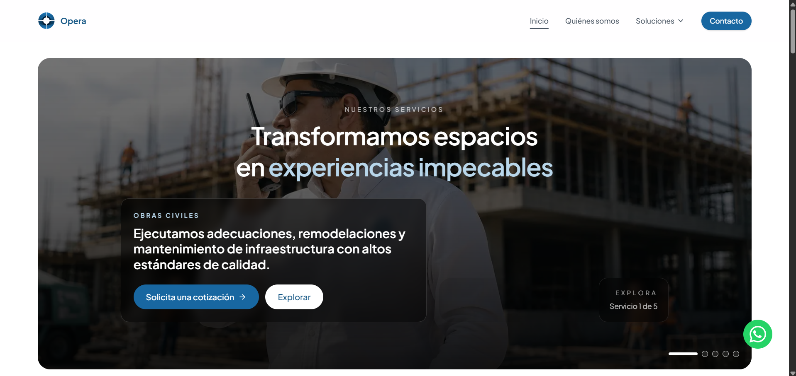
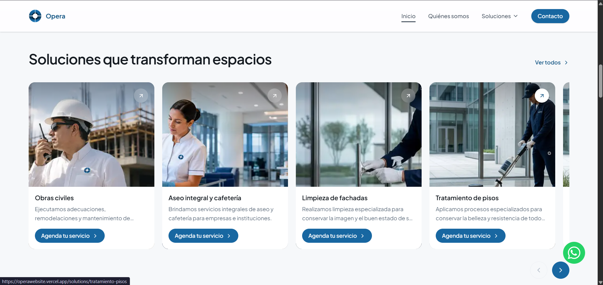

<div align="center">

# Opera

**Sitio web corporativo para servicios de mantenimiento, limpieza y jardinería.**

Construido con Next.js 16 · React 19 · TypeScript · Tailwind CSS v4

[](https://nextjs.org/)
[](https://react.dev/)
[](https://www.typescriptlang.org/)
[](https://tailwindcss.com/)

[Ver demo en vivo](https://operawebsite.vercel.app)

</div>

---

<div align="center">





</div>

---

## Acerca del proyecto

Opera es el sitio corporativo de una empresa de servicios integrales ubicada en Barranquilla, Colombia. Ofrece soluciones en:

- **Obras civiles** — Adecuaciones, remodelaciones y mantenimiento de infraestructura
- **Aseo integral y cafetería** — Servicios de limpieza para empresas e instituciones
- **Limpieza de fachadas** — Limpieza especializada para conservar la imagen del edificio
- **Tratamiento de pisos** — Procesos de pulido y restauración
- **Jardinería y paisajismo** — Mantenimiento de zonas verdes

El proyecto está diseñado para crecer: añadir páginas, secciones y módulos sin reescribir lo existente, y para conectarse a un **CMS (Sanity)** más adelante con cambios mínimos.

---

## Tech stack

| Categoría | Tecnología |
|-----------|-----------|
| Framework | [Next.js 16](https://nextjs.org/) (App Router) |
| UI | [React 19](https://react.dev/) (Server Components por defecto) |
| Lenguaje | [TypeScript 5](https://www.typescriptlang.org/) |
| Estilos | [Tailwind CSS v4](https://tailwindcss.com/) con design tokens en `@theme` |
| Iconos | [Lucide React](https://lucide.dev/) |
| Formularios | [EmailJS](https://www.emailjs.com/) |
| Despliegue | [Vercel](https://vercel.com/) |

---

## Funcionalidades

- **Hero con carrusel** — Rotación automática de servicios con controles manuales
- **Carrusel de servicios** — Scroll horizontal con snap behavior
- **Mega-menú** — Navegación por sectores (Corporativo, Residencial, Salud, Industrial)
- **Páginas de solución** — Ruta dinámica `/solutions/[slug]` con detalle por servicio
- **Animaciones de scroll** — Fade-up con el componente `Reveal`
- **Imágenes con parallax** — Efecto de profundidad en secciones clave
- **Botón de WhatsApp** — Integración flotante para contacto directo
- **Diseño responsive** — Mobile-first con breakpoints para todas las pantallas
- **SEO** — Metadata por página, Open Graph con locale `es_CO`
- **Comparativa** — Tabla Opera vs proveedores tradicionales
- **FAQ** — Acordeón de preguntas frecuentes
- **Páginas legales** — Privacidad, términos y condiciones, cookies

---

## Puesta en marcha

```bash
# Instalar dependencias
npm install

# Servidor de desarrollo
npm run dev        # → http://localhost:3000

# Build de producción
npm run build
npm run start

# Linting
npm run lint
```

---

## Estructura del proyecto

```
opera/
├── app/                          # Rutas (App Router)
│   ├── layout.tsx                # Layout raíz: fuentes, metadata, Header, Footer
│   ├── page.tsx                  # Home — compone las secciones
│   ├── globals.css               # Tailwind + design tokens
│   ├── about-us/                 # Página "Quiénes somos"
│   ├── solutions/                # Soluciones por servicio y sector
│   │   ├── page.tsx
│   │   └── [slug]/page.tsx       # Detalle de cada servicio
│   └── legal/                    # Páginas legales
│
├── components/
│   ├── ui/                       # Primitivos reutilizables
│   │   ├── button.tsx
│   │   ├── container.tsx
│   │   ├── section.tsx
│   │   ├── reveal.tsx            # Animación fade-up en scroll
│   │   ├── parallax-image.tsx
│   │   ├── scroll-carousel.tsx
│   │   └── whatsAppBtn.tsx
│   ├── layout/                   # Header y Footer
│   └── sections/                 # Bloques de página (hero, services, faq…)
│
├── content/                      # Contenido editorial (datos locales)
│   ├── site.ts                   # Configuración global (nav, contacto, footer)
│   ├── home.ts                   # Contenido de la home
│   ├── about.ts                  # Contenido de "Quiénes somos"
│   └── solutions.ts              # Contenido de soluciones
│
├── lib/
│   ├── content.ts                # Proveedor de contenido (única frontera de datos)
│   ├── whatsapp.ts               # Builders de URLs de WhatsApp
│   └── utils.ts                  # Utilidades (cn)
│
├── types/
│   └── content.ts                # Modelos de contenido (TypeScript)
│
└── public/img/                   # Assets estáticos (logos, banners, servicios)
```

---

## Convenciones de arquitectura

**Server Components por defecto** — Solo se usa `"use client"` donde hay interactividad (header, carruseles, formulario, FAQ).

**Contenido desacoplado** — Las páginas y secciones reciben datos vía props desde `lib/content.ts`. Esto permite cambiar la fuente de datos sin tocar componentes.

**Design tokens centralizados** — Colores, tipografía y radios se definen en `app/globals.css` dentro del bloque `@theme` de Tailwind v4, generando clases como `bg-brand-600` y `text-ink-500`.

**Alias de importación** — `@/*` apunta a la raíz del proyecto (e.g. `@/components/ui/button`).

---

## Cómo extender

<details>
<summary><strong>Añadir una sección a la home</strong></summary>

1. Crea el componente en `components/sections/mi-seccion.tsx`.
2. Define su contenido y tipos en `types/content.ts` + `content/home.ts`.
3. Renderízalo en `app/page.tsx` dentro de un `<Section>` + `<Container>`.

</details>

<details>
<summary><strong>Añadir una página nueva</strong></summary>

Crea una carpeta en `app/` con un `page.tsx` (App Router, basado en archivos).
Ejemplo: `app/blog/page.tsx`.

</details>

<details>
<summary><strong>Añadir un servicio</strong></summary>

Edita `content/home.ts` → `services.items`. Cada servicio tiene `slug` para generar la ruta `/solutions/[slug]`.

</details>

<details>
<summary><strong>Conectar Sanity CMS</strong></summary>

La migración es un cambio de un solo archivo: `lib/content.ts`.

1. Crear esquemas en Sanity que reflejen los modelos de `types/content.ts`.
2. Reemplazar las funciones de `lib/content.ts` por llamadas `client.fetch(...)`. Las firmas ya son `async`.
3. Añadir `cdn.sanity.io` a `remotePatterns` en `next.config.ts`.

</details>

---

## Roadmap

- [ ] Conectar formulario de contacto a backend (Route Handler o Server Action)
- [ ] Página `/blog`
- [ ] Reemplazar imágenes placeholder por assets de marca
- [ ] `opengraph-image.tsx`, `sitemap.ts` y `robots.ts` para SEO
- [ ] Integración con Sanity CMS

---

## Licencia

Proyecto privado. Todos los derechos reservados.
